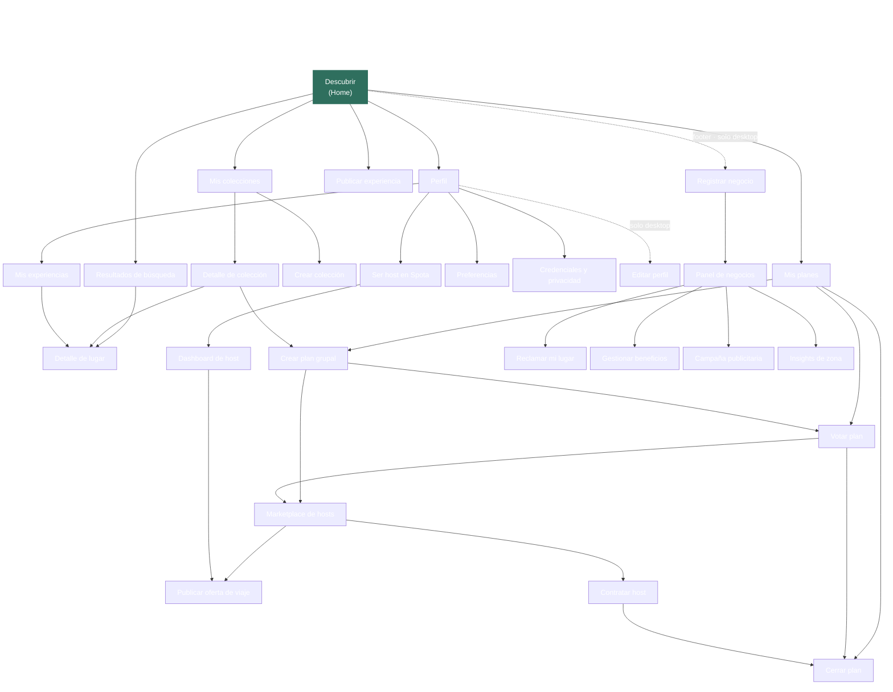

# Informe — Arquitectura de información de Spota

**Producto:** Spota — plataforma de experiencias urbanas locales de Nexo Local S.A.S.
**Alcance del informe:** mapa desde el hub con páginas accesibles, rutas de navegación, validación con tree testing y justificación de decisiones de diseño.

---

## 1. Introducción

Spota es la plataforma tecnológica de Nexo Local S.A.S., orientada a residentes urbanos de 18 a 45 años en CABA/AMBA. El producto se posiciona como **concierge inteligente, no buscador**: interpreta la intención del usuario en lenguaje natural y le recomienda experiencias alineadas a sus gustos, contexto y compañía. El problema central que resuelve es la **fatiga de decisión**: las personas no carecen de opciones, carecen de certeza sobre cuál elegir.

El ecosistema involucra tres actores que se necesitan mutuamente: usuarios que buscan experiencias, hosts locales (casuales y certificados) que monetizan su conocimiento, y negocios locales que se posicionan como socios de crecimiento. La plataforma es gratuita para el usuario; la monetización se construye sobre comisiones por contratación de hosts, fees por experiencias comerciales, SaaS de insights B2B y publicidad segmentada.

Este informe describe la arquitectura de información que sostiene esa propuesta: cómo se distribuyen las pantallas alrededor del hub, cómo se justifican las rutas de navegación, qué teoría de UX/UI sustenta cada decisión visual y cómo se validó el conjunto con un test de árbol.

---

## 2. Sitio navegable e inventario de pantallas

El prototipo se entrega como **dos sitios autocontenidos** servidos en paralelo, deployados en GitHub Pages:

- **Mobile** — [Spota Prototipo (mobile)](https://ajoaquincardozo.github.io/spota-design-from-claude-code/prototipo/Spota%20Prototipo.html) — 375 px, breakpoint mínimo
- **Desktop** — [Spota Prototipo (desktop)](https://ajoaquincardozo.github.io/spota-design-from-claude-code/prototipo-desktop/Spota%20Prototipo%20Desktop.html) — 1024 px mínimo, óptimo a 1280 +

Ambos prototipos se levantan también localmente con `python3 -m http.server` desde sus respectivas carpetas (`prototipo/` en puerto 8000, `prototipo-desktop/` en 8001).

Ambos prototipos cubren los **23 casos de uso** del MVP, superando las 20 pantallas requeridas. Las pantallas se agrupan en siete bloques funcionales:

| Bloque | Pantallas | CUs |
|---|---|---|
| **Onboarding y Auth** | Iniciar sesión, Crear cuenta, Recuperar contraseña, Preferencias, Credenciales y privacidad, Bienvenida (solo desktop), Editar perfil (solo desktop) | CU-01 a CU-05 |
| **Descubrir** | Descubrir (Home, concierge-first), Resultados de búsqueda, Detalle de lugar | CU-06 |
| **Experiencias y reputación** | Publicar experiencia, Valorar lugar de la comunidad, Mis experiencias | CU-07 a CU-09 |
| **Colecciones** | Mis colecciones, Detalle de colección, Crear colección | CU-10 a CU-11 |
| **Planificación grupal** | Mis planes, Crear plan grupal, Votar plan, Cerrar plan | CU-12 a CU-14 |
| **Marketplace de Hosts** | Marketplace de hosts, Publicar oferta de viaje, Contratar host, Ser host en Spota, Dashboard de host | CU-15 a CU-18 |
| **Negocios B2B** | Registrar negocio, Panel de negocios, Reclamar mi lugar, Gestionar beneficios, Campaña publicitaria, Insights de zona | CU-19 a CU-23 |

### 2.1 Casos de uso del MVP

Los 23 casos de uso que sustentan la propuesta del MVP, organizados por bloque y actor:

| CU | Nombre | Actor | Bloque |
|---|---|---|---|
| CU-01 | Registrar cuenta | Usuario | Onboarding y Auth |
| CU-02 | Iniciar sesión | Usuario | Onboarding y Auth |
| CU-03 | Recuperar contraseña | Usuario | Onboarding y Auth |
| CU-04 | Gestionar preferencias | Usuario | Onboarding y Auth |
| CU-05 | Gestionar credenciales | Usuario | Onboarding y Auth |
| CU-06 | Descubrir experiencias por intención | Usuario | Descubrir |
| CU-07 | Publicar experiencia | Usuario | Experiencias y reputación |
| CU-08 | Valorar experiencia de la comunidad | Usuario | Experiencias y reputación |
| CU-09 | Gestionar experiencias propias | Usuario | Experiencias y reputación |
| CU-10 | Crear colección | Usuario | Colecciones |
| CU-11 | Explorar colecciones de la comunidad | Usuario | Colecciones |
| CU-12 | Crear plan grupal | Usuario | Planificación grupal |
| CU-13 | Votar opciones del plan grupal | Participante | Planificación grupal |
| CU-14 | Cerrar plan grupal | Usuario | Planificación grupal |
| CU-15 | Publicar oferta de viaje | Usuario | Marketplace de Hosts |
| CU-16 | Contratar host | Usuario | Marketplace de Hosts |
| CU-17 | Registrarse como host | Host | Marketplace de Hosts |
| CU-18 | Postularse a oferta de viaje | Host | Marketplace de Hosts |
| CU-19 | Reclamar perfil del lugar | Negocio | Negocios B2B |
| CU-20 | Registrar negocio asociado | Negocio | Negocios B2B |
| CU-21 | Gestionar beneficios exclusivos | Negocio | Negocios B2B |
| CU-22 | Configurar campaña publicitaria | Negocio | Negocios B2B |
| CU-23 | Acceder al panel de insights | Negocio | Negocios B2B |

---

## 3. Arquitectura de información

### 3.1 Árbol jerárquico desde el hub

Vista vertical completa partiendo del usuario logueado en `Descubrir` (Home). Cada flecha equivale a un click. Las ramas con línea punteada dependen de la plataforma.

### 3.2 Lectura del árbol

- La profundidad máxima del producto es **4 clicks** (Home → Mis planes → Crear plan grupal → Marketplace de hosts → Contratar host). Esto respeta la regla 5±2 a nivel macro: ningún flujo del usuario obliga a recorrer más de cinco saltos.
- Las **acciones core del usuario** (buscar, publicar, ver mis cosas, planificar) están a 1 o 2 clicks desde el Home.
- El **Marketplace de Hosts** es deliberadamente la rama más profunda. Por decisión de producto, no tiene entry directo desde Discover ni desde el Perfil del usuario: solo se accede desde un plan grupal. Sin un plan que ancle la decisión, contratar un host es una elección sin contexto.
- El **Panel de Negocios** es accesible para un usuario logueado solo en desktop, vía footer del frame general. En mobile la transición a B2B requiere desloguearse y entrar como Negocio desde el toggle del login. La asimetría es deliberada: un usuario *se vuelve* host (evolución del rol), un usuario *es dueño* de un negocio (identidad separada).

---

## 4. Justificación de la navegación

La arquitectura de la nav principal cambia entre mobile y desktop por adaptación de plataforma, pero los flujos del usuario son idénticos.

| Capa | Mobile | Desktop | Justificación |
|---|---|---|---|
| Shell de navegación | TabBar inferior con FAB central, 5 ítems | TopNav superior con 3 ítems + acciones derecha + footer | Mobile prioriza el alcance del pulgar; desktop prioriza el cursor y aprovecha aire horizontal |
| Acceso al Perfil | Tab dedicado | Avatar en top-right (único entry) | El avatar es affordance universal en consumer apps (Instagram, GitHub, Twitter); deja el navbar enfocado en producto |
| Buscador permanente en navbar | n/a | Eliminado | Una vez que el input del home se vuelve hero, un buscador secundario persistente compite por la atención y rompe la tesis "buscar es expresar intención" |
| Resultados de búsqueda | Toggle Lista / Mapa | Lista 60 % + Mapa 40 % sticky simultáneos | En desktop hay espacio para ambos sin penalizar lectura |

### 4.1 Concierge-first en el home

El Discover no muestra recomendaciones por default. La pantalla queda con saludo + input hero + atajos discretos por categoría + ejemplos clicables. Las recomendaciones aparecen recién en `searchResults`, cuando el usuario expresó intención. Esta decisión sostiene la tesis del producto: un *concierge* no opera sin contexto. Ofrecer 12 cards a un usuario que no pidió nada es lo que hacen TripAdvisor, Google Maps o un buscador genérico. Spota no es eso.

Cuando el usuario tipea, un parser heurístico (`interpretQuery`) extrae las dimensiones de la query (ambiente, compañía, momento, categoría, zona) y las muestra como **chips de intención** sobre los resultados. Cada card incluye además un **chip cualitativo de match** (Alto match / Buen match) y mini-avatares de "gente como vos" como traducción humana del Fama Score predictivo.

### 4.2 Profundidad y reglas aplicadas

- **Regla 5±2** — la TabBar mobile tiene 5 ítems; los filtros del mapa, 4; los stats del perfil, 3. Las decisiones bajo carga cognitiva se mantienen en el rango bajo del límite de Miller.
- **Ley de Hick** — el tiempo de decisión crece con la cantidad de opciones visibles. La nav principal limita el primer nivel de elección a 3-5 destinos; el resto del catálogo se accede contextualmente.
- **Ley de Fitts** — el FAB central de Publicar (mobile) y el botón de Publicar a la derecha del TopNav (desktop) son los dos targets más importantes para alimentar el modelo. Ambos reciben máximo contraste cromático (terracota sobre verde) y posición de mínima fricción.

---

## 5. Paleta de colores según orientación del negocio

Spota no es un servicio tecnológico genérico ni un agregador frío de opiniones. El producto se posiciona como **concierge inteligente con identidad barrial**, comunitaria y cálida, asociado a comercios y experiencias reales. Esa orientación descarta los códigos cromáticos del sector tech (azul corporativo, gris neutro) y los códigos del entretenimiento masivo (rojo intenso, negro).

La paleta elegida se nombra **Cercanía Local**:

| Rol | Color | Hex | Justificación de negocio |
|---|---|---|---|
| Primario | Verde petróleo | `#2F6F5E` | Equilibrio, confianza, cercanía. Aporta seriedad sin caer en el azul corporativo. Conduce navegación, acciones primarias y verificaciones |
| Secundario | Terracota | `#B85C38` | Lo local, lo humano, lo artesanal. Remite al ladrillo, al barro cocido, a la fachada del barrio. Conduce conversiones y tags emocionales |
| Acento | Arena dorada | `#E9A23B` | Valor, beneficio, distinción. Refuerza el Fama Score y los premios visuales sin sonar a tier pago |
| Fondo | Crema | `#FFF8ED` | Calidez ambiente. Reemplaza al blanco puro, que asocia el producto con superficies clínicas o tech |
| Texto | Marrón oscuro | `#2B2523` | Contraste alto sobre crema sin la dureza del negro |

El criterio del enunciado se aplica de forma inversa: una propuesta de comedia justificaría rojo y marrón porque su orientación convoca emoción y lo análogo; una propuesta tecnológica justificaría azul o gris porque su orientación convoca racionalidad y precisión. En Spota la orientación es local-cálida, por lo que la paleta se construye con verdes, ocres y arenas, alejándose de los códigos tech y de los códigos del espectáculo.

> La paleta vive como fuente de verdad en el **UI Kit del propio prototipo**, accesible en runtime: en mobile desde Perfil → Cuenta → "UI Kit · Design System"; en desktop desde el ícono ✦ del TopNav.

---

## 6. Tipografía

Se utilizan dos familias complementarias. La principal es **DM Sans**, sans-serif moderna y legible, que cubre toda la interfaz funcional (botones, inputs, cards, navegación, cuerpo de texto). La secundaria es **Fraunces** en cursiva, una serif contemporánea que aparece exclusivamente en acentos cortos sobre titulares ("cerca tuyo", "hoy", "Maestro", "ambiente · tranquilo"). El contraste entre la geometría neutra de DM Sans y el carácter expresivo de Fraunces produce un efecto editorial sin sacrificar legibilidad.

La jerarquía respeta tres pesos: regular (400) para cuerpo, semibold (600) para énfasis y subtítulos, bold (700) para titulares. El tamaño mínimo de cuerpo es 14 px, conforme a las recomendaciones de accesibilidad para mobile-first.

La elección dialoga con la paleta: Fraunces italic transmite calidez y voz humana, lo mismo que terracota y crema; DM Sans aporta legibilidad operativa, lo mismo que verde petróleo en navegación. La tipografía es coherente con el posicionamiento del negocio.

---

## 7. Diseño según teoría — leyes de UX/UI aplicadas

| # | Ley | Aplicación concreta en Spota |
|---|---|---|
| 1 | **Ley de Fitts** | FAB central de Publicar (mobile) y botón terracota de Publicar (desktop) en posiciones de mínima fricción. Áreas táctiles de 44 px mínimo en mobile. CTAs primarios dentro del thumb-zone |
| 2 | **Ley de Hick** | TabBar de 5 ítems, filtros del mapa de 4, stats de perfil de 3. La cantidad de opciones visibles se acota para sostener decisiones rápidas |
| 3 | **Ley de Miller (5 ± 2)** | La memoria de trabajo retiene de 5 a 9 unidades. La nav y los grupos visuales del producto se mantienen dentro del rango |
| 4 | **Ley de Jakob** | El usuario espera que el producto funcione como otros conocidos. Spota adopta patrones del ecosistema: tab bar inferior con FAB central (Instagram, Airbnb), cards con foto dominante y rating (Airbnb), modales para acciones rápidas en desktop |
| 5 | **Ley de Pareto (80/20)** | Las acciones de mayor frecuencia (descubrir, publicar, planificar) ocupan la TabBar y el FAB; el resto del catálogo vive en niveles secundarios accesibles desde tarjetas o contextos específicos |
| 6 | **Ley de Tesler** | La complejidad irreductible la absorbe el motor de recomendación: el usuario expresa intención en lenguaje natural ("café tranquilo para charlar"), el sistema interpreta y devuelve resultados. No hay filtros obligatorios |
| 7 | **Ley de proximidad (Gestalt)** | Stats del perfil agrupados en grilla compacta; chips de categoría en un solo contenedor; bullets de beneficio del entry-card Host en una línea visual |
| 8 | **Ley de similitud (Gestalt)** | Código cromático consistente: terracota = descubrimiento (Popular, Nuevo, Recomendado); verde = verificación (Proof of Visit); arena = valor (rating, beneficios, niveles del Fama Score) |
| 9 | **Efecto Von Restorff** | El FAB central terracota destaca sobre la TabBar verde; el badge "Visitado" en verde se separa de los tags emocionales en terracota; el input hero del home rompe con surface y borde primary para volverse protagonista |
| 10 | **Ley de Doherty (400 ms)** | Transiciones cortas (sheets 240 ms, hover 150 ms, fadeIn de placeholders 250 ms). El loading concierge ("Leyendo tus gustos…") dura ~750 ms para comunicar "hay un cerebro detrás" sin penalizar la rapidez |

---

## 8. Validación con tree testing — propuesta metodológica

> **Nota.** El test no se ejecutó dentro de la ventana de la entrega. Esta sección documenta la metodología que se habría aplicado, las tareas que se habrían evaluado, los umbrales de éxito esperados y el plan de iteración. El árbol fue cargado en TreeJack (Optimal Workshop) con la estructura de la sección 3.1.

### 8.1 Por qué tree testing y no card sorting

**Card sorting** es útil cuando se construye la taxonomía de cero (los participantes agrupan cards con conceptos sin estructura previa). Spota ya tiene una arquitectura definida por los CUs del MVP; la pregunta no es "¿cómo agruparían las funciones?", sino "¿pueden encontrar cada función en la taxonomía propuesta?".

**Tree testing** responde exactamente esa pregunta. Se le presenta al usuario el árbol de navegación sin diseño visual y se le pide ejecutar tareas concretas; la herramienta mide si cada tarea termina en el destino correcto y por qué camino. Es el método estándar para validar arquitectura de información antes de invertir en alta fidelidad.

### 8.2 Herramienta y población

- **Herramienta**: TreeJack (Optimal Workshop). El árbol se exporta como `.xls` con cinco columnas (TOP / 2ND / 3RD / 4TH / 5TH LEVEL) según la profundidad real del producto.
- **Población objetivo**: residentes de CABA/AMBA, 18 a 45 años, con cultura de salidas frecuentes (alineado al perfil time-poor del brief). Mínimo 30 participantes para alcanzar significancia estadística básica.
- **Modalidad**: remoto, no moderado, autoadministrado. Duración estimada por participante: 8 a 12 minutos.

### 8.3 Tareas evaluadas

Las seis tareas siguientes cubren los flujos críticos del producto y los puntos de la arquitectura que tienen mayor probabilidad de fricción:

| # | Tarea (tal como se le presenta al participante) | Destino correcto | Hipótesis a validar |
|---|---|---|---|
| 1 | "Querés contratar un guía local para una salida grupal el sábado. ¿Adónde irías?" | Mis planes → Crear plan grupal → Marketplace de hosts → Contratar host | Validar que el entry contextual del Marketplace desde el plan se entiende sin entry directo |
| 2 | "Tenés un bar en Palermo y querés sumar tu negocio a la plataforma." | Footer · Registrar negocio → Panel de negocios | Validar que la entrada al panel B2B es descubrible desde el footer (D3) |
| 3 | "Te interesa convertirte vos mismo en host." | Perfil → Ser host en Spota | Validar la asimetría: host vive adentro del perfil, negocio afuera |
| 4 | "Querés ver las experiencias que publicaste el mes pasado." | Perfil → Mis experiencias | Validar que la nomenclatura "Mis experiencias" se asocia con el historial de publicaciones |
| 5 | "Querés crear una colección de cafés de Palermo y compartirla con tus amigos." | Mis colecciones → Crear colección | Validar que Colecciones es entendido como contenedor temático |
| 6 | "Querés cambiar tu contraseña." | Perfil → Credenciales y privacidad | Validar que el bucket "Credenciales y privacidad" cubre el cambio de password |

### 8.4 Métricas y umbrales de éxito

TreeJack reporta cuatro métricas por tarea:

| Métrica | Definición | Umbral aceptable | Umbral excelente |
|---|---|---|---|
| **Success rate** | % de participantes que llegan al destino correcto | ≥ 60 % | ≥ 80 % |
| **Directness** | % que llegan sin retroceder en el árbol | ≥ 60 % | ≥ 75 % |
| **First-click rate** | % que aciertan el primer paso (rama del nivel 1) | ≥ 50 % | ≥ 70 % |
| **Tiempo medio** | Segundos en completar la tarea | ≤ 60 s | ≤ 30 s |

Una tarea con success rate < 50 % indica un problema serio de arquitectura o nomenclatura. Una tarea con first-click rate < 40 % indica que el rótulo del nivel 1 no comunica lo que el usuario espera (problema de naming, no de estructura).

### 8.5 Plan de iteración según resultados

| Resultado anticipado | Lectura | Acción de diseño |
|---|---|---|
| Tarea 1 (host) por debajo del umbral en first-click | El usuario busca el Marketplace por fuera del plan; la entrada contextual no es descubrible | Reabrir D10. Evaluar entry secundario discreto desde Discover |
| Tarea 2 (negocio) por debajo del umbral en success rate | El footer no es affordance suficiente para entrar al panel B2B | Sumar entry desde el menú del avatar o un onboarding específico |
| Tarea 3 (ser host) confunde con "Registrar negocio" | El usuario no distingue host y negocio | Reescribir el copy del menú de perfil; quizás separar "Trabajar en Spota" de "Soy un negocio" |
| Tarea 6 (cambiar contraseña) por debajo del umbral | "Credenciales y privacidad" se entiende como privacidad pública, no como cambio de password | Renombrar a "Cuenta y seguridad" o desagregar en dos buckets |

La metodología prevé una segunda ronda de testing tras los ajustes para cerrar el ciclo (test → ajuste → re-test).

### 8.6 Limitaciones del enfoque

- Tree testing valida la **arquitectura**, no el diseño visual. Una pantalla puede tener buen árbol y mala UI, o viceversa.
- El test no captura comportamiento exploratorio (el "scroll para inspirarse"). Eso requiere usability testing posterior con prototipo navegable.
- 30 participantes detectan problemas mayores; problemas sutiles requieren muestras más grandes.

---

## 9. Conclusiones

La arquitectura de información de Spota se construye alrededor de un hub único (`Discover` / Home) y distribuye los 23 casos de uso en cuatro niveles de profundidad máxima. Las decisiones tomadas durante el prototipado —concierge-first en el home, asimetría de hosts y negocios, entry contextual del Marketplace, perfil accesible solo por avatar en desktop— responden a una tesis consistente con el brief: el producto interpreta intención, no presenta opciones genéricas.

La paleta y la tipografía elegidas refuerzan el posicionamiento barrial-cálido del negocio, alejándose deliberadamente de los códigos tech (azul, gris) y del espectáculo (rojo, negro). Las leyes de UX/UI aplicadas (Fitts, Miller, Hick, Jakob, Tesler, Gestalt, Von Restorff, Doherty) se materializan en decisiones concretas y verificables en cada pantalla.

La validación por tree testing queda planteada metodológicamente, lista para ejecutarse en una próxima fase del trabajo. El árbol cargado en TreeJack y las seis tareas críticas definidas son suficientes para detectar los puntos de fricción de mayor impacto. Los resultados retroalimentarán el siguiente ciclo de iteración.

El UI Kit del prototipo es accesible en runtime desde la propia app y oficia como fuente de verdad del design system. En mobile se entra desde Perfil → Cuenta → "UI Kit · Design System"; en desktop, desde el ícono ✦ del TopNav. Allí conviven los tokens de paleta, la escala tipográfica, los componentes (PlaceCard, FamaScore, IntentChips, AffineRow, ProofOfVisit, Tag, Btn) y los estados visuales que se usan a lo largo del producto.
