# Mapa de navegación — Spota

Este documento describe los flujos del usuario en el prototipo de Spota, comparando mobile y desktop. La regla es **mismos casos de uso, distinto shell**: los 23 CUs y todos los flujos del usuario son idénticos en ambas plataformas; lo que cambia es la composición de la navegación principal y la composición visual de algunas pantallas pivote, todas justificadas por decisiones consolidadas en `Claude.md` (D1-D18).

Los diagramas usan sintaxis Mermaid, que renderiza nativo en GitHub y en VS Code preview. Los identificadores entre paréntesis son los `id` reales de las pantallas registradas en `SCREENS` dentro de cada prototipo.

---

## 1. Árbol de navegación — vista vertical

Vista jerárquica completa partiendo del usuario logueado en `Descubrir` (Home). Cada flecha equivale a un click. Los nombres son los títulos humanos en español; las pantallas que dependen de la plataforma se marcan con línea punteada y nota.

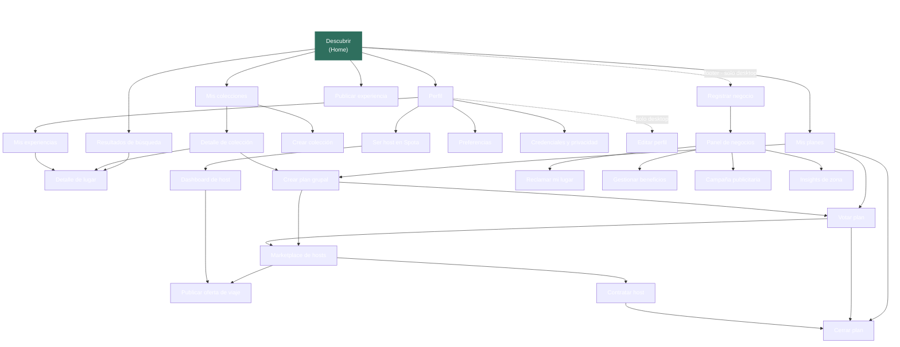

**Lectura del árbol**

- La profundidad máxima del prototipo es **4 clicks** (Home → Mis planes → Crear plan grupal → Marketplace de hosts → Contratar host). Coherente con la regla 5±2 a nivel macro.
- Las acciones core del usuario (buscar, publicar, ver mis cosas) están a **1 o 2 clicks** del Home.
- El Marketplace de Hosts es deliberadamente la rama más profunda (D10): se accede solo desde un plan, sin entry directo.
- El Panel de Negocios es accesible para un usuario logueado solo en desktop (footer del DesktopFrame con `params.from = 'home'`, D17). En mobile la transición a B2B requiere desloguearse y entrar como Negocio desde el toggle del login.
- Las flechas dotted marcan ramas dependientes de plataforma; las sólidas son comunes a mobile y desktop.

---

## 2. Shell de navegación

El shell es la única capa donde mobile y desktop divergen estructuralmente. Las pantallas internas se acceden a través de él.

### 2.1 Mobile — TabBar inferior con FAB central

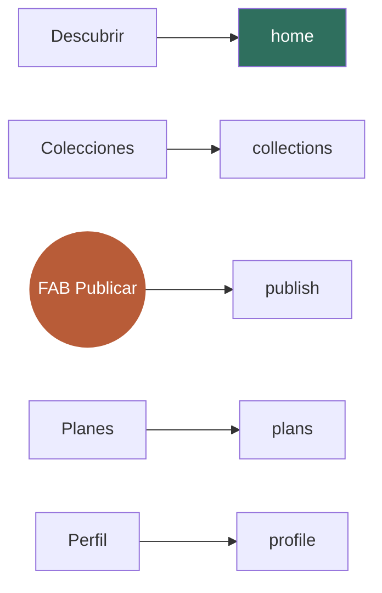

Cinco ítems en la barra inferior. El FAB central en terracota es el atajo a `publish` (CU-07). Las cuatro pestañas convencionales priorizan el alcance del pulgar (los ítems extremos quedan en zona accesible para diestros y zurdos).

### 2.2 Desktop — TopNav superior + footer

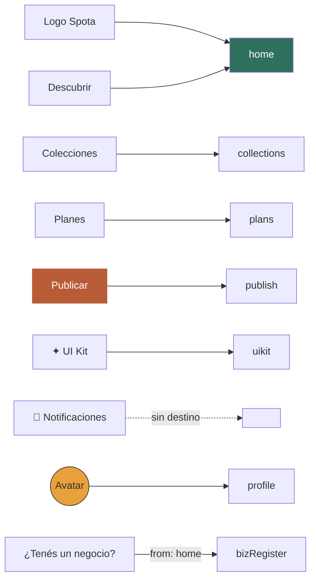

Tres ítems centrales (sin Perfil — D13) y un grupo de acciones a la derecha. **No hay buscador permanente en el TopNav** (D18): la búsqueda es una acción explícita que vive en el home como input hero. El acceso al panel de Negocios se realiza desde el footer del frame con `params.from = 'home'` (D17).

---

## 3. Mapas por bloque funcional

Cada bloque representa un ciclo del usuario. Los flujos son idénticos en mobile y desktop salvo cuando se indica.

### 3.1 Onboarding y Auth — CU-01 a CU-05

**Mobile**

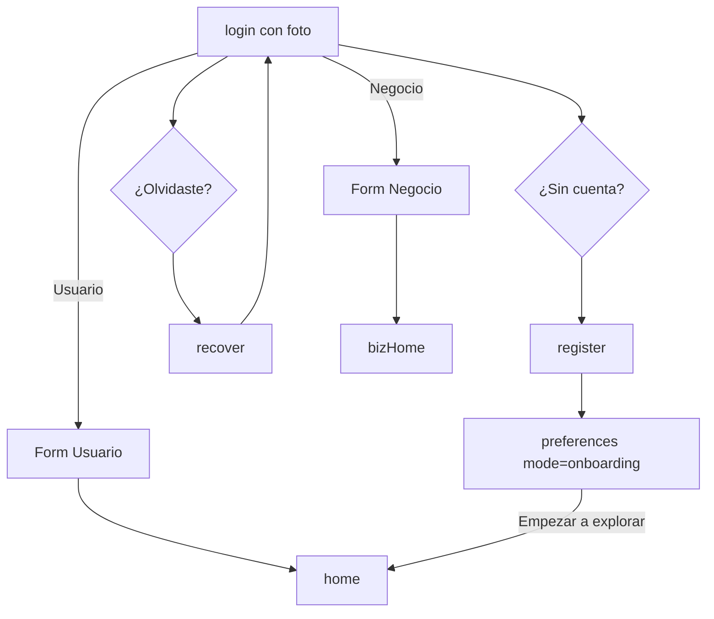

**Desktop**

```mermaid
flowchart TD
    Welcome[welcome - landing pública] -->|Iniciar sesión| Login[login split layout]
    Welcome -->|Crear cuenta| Register[register]
    Welcome -->|¿Tenés un negocio?| BizReg[bizRegister from=welcome]
    Login -->|Usuario| Home[home]
    Login -->|Negocio toggle| BizHome[bizHome]
    Login -->|¿Olvidaste?| Recover[recover]
    Login -->|Sumalo en footer| BizReg2[bizRegister from=login]
    Register --> Preferences[preferences mode=onboarding]
    Preferences -->|Empezar a explorar| Home
    Recover --> Login
```

**Diferencias estructurales del bloque**

| Aspecto | Mobile | Desktop | Decisión |
|---|---|---|---|
| Pantalla pública previa al login | No existe (Splash eliminado) | `welcome` como landing pública | D15 |
| Layout del login | Foto fullscreen integrada | Split (foto+hero a la izquierda 55 %, form a la derecha 45 %) | D15, D16 |
| Toggle Usuario/Negocio | Adentro del form de login | Adentro del form (igual) | D3 |
| Entry a bizRegister | Solo desde toggle del login | Desde welcome, footer DesktopFrame, footer del login (cada uno con `params.from`) | D3, D17 |

### 3.2 Descubrir — CU-06

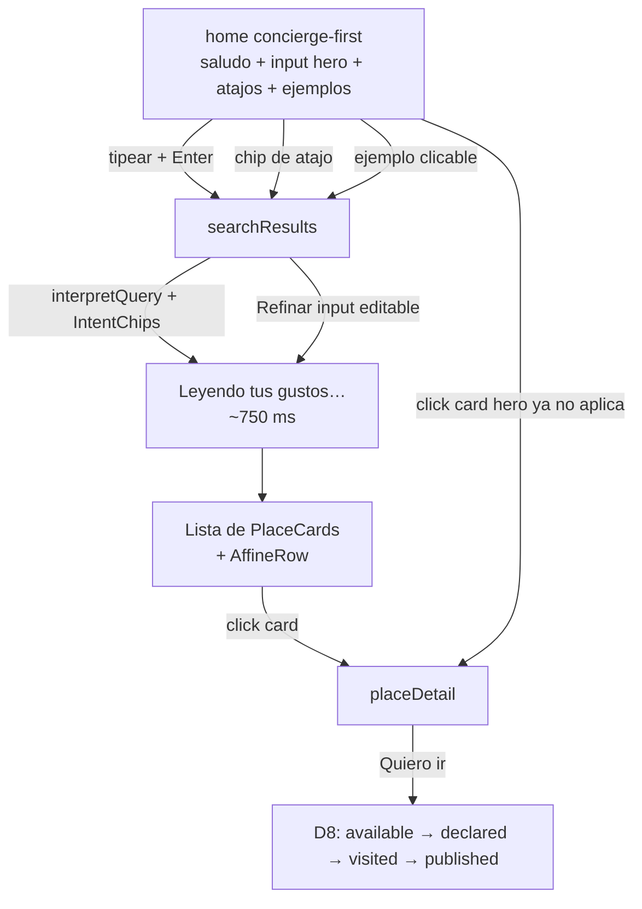

**Diferencias estructurales del bloque**

| Aspecto | Mobile | Desktop |
|---|---|---|
| Vista de resultados | Toggle Lista / Mapa en `searchResults` | Lista 60 % + Mapa 40 % sticky simultáneos (D12) |
| Composición del home | Atajos en flexbox wrap, ejemplos en columna | Atajos en flexbox wrap, ejemplos en grid de 3 columnas, max-width 760 px centrado |
| Input hero | Alto 64 px | Alto 72 px |
| Buscador secundario persistente | n/a | Eliminado (D18) |

### 3.3 Experiencias y reputación — CU-07 a CU-09

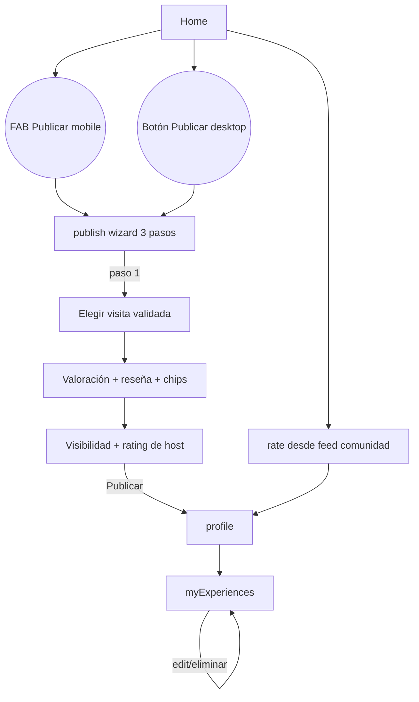

**Notas**

- D9 estableció wizard de 3 pasos (no 4): la validación GPS ocurre en background y no aparece en el wizard.
- Entry a `publish`: en mobile es el FAB central (D2); en desktop es el botón "Publicar" en el TopNav (extremo derecho, terracota). En ambos es prominente.
- `myExperiences` solo se accede desde Perfil → bloque "Mis experiencias", coherente en ambas plataformas.

### 3.4 Colecciones — CU-10 a CU-11

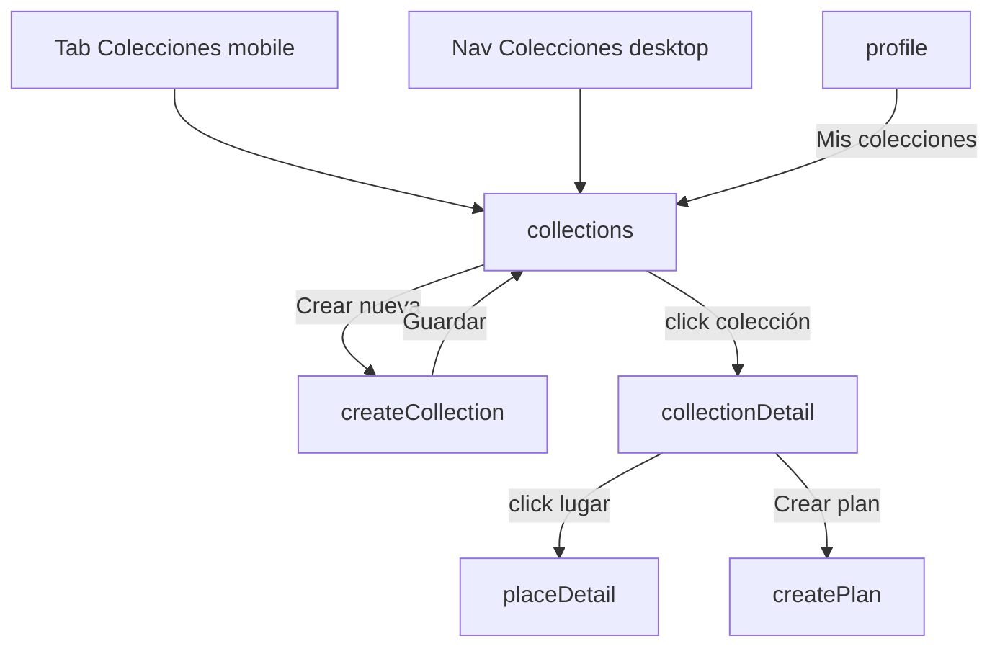

**Notas**

- `createCollection` es modal en desktop (sobre overlay), pantalla full-screen en mobile.
- `collectionDetail` ofrece dos exits funcionales: ir al lugar (`placeDetail`) o convertir la colección en plan grupal (`createPlan`).

### 3.5 Planificación grupal — CU-12 a CU-14

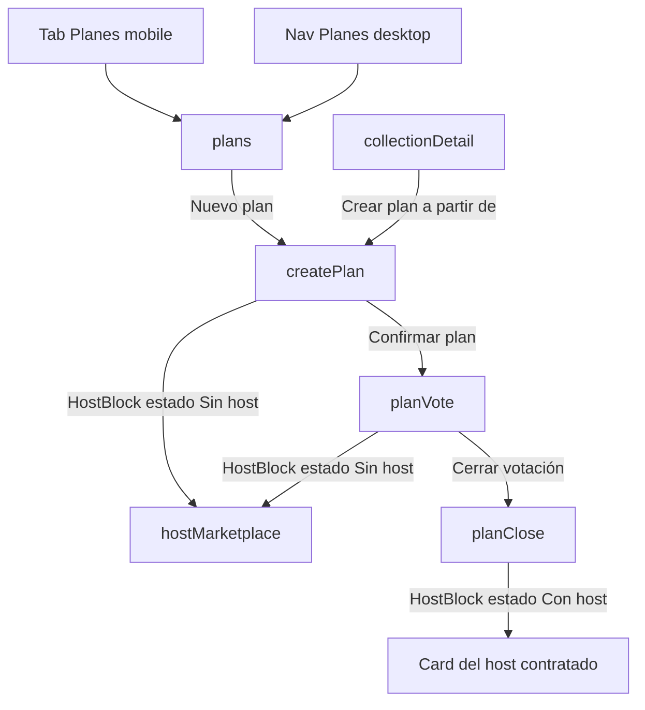

**Notas**

- D10 define la sub-máquina del host como slot persistente en `createPlan`, `planVote` y `planClose`. Solo el creador del plan opera la sub-máquina; los participantes ven el bloque pero no actúan.
- Transición irreversible: una vez contratado un host, no se cancela desde el flujo (sería decisión sin contexto).

### 3.6 Marketplace de Hosts — CU-15 a CU-18

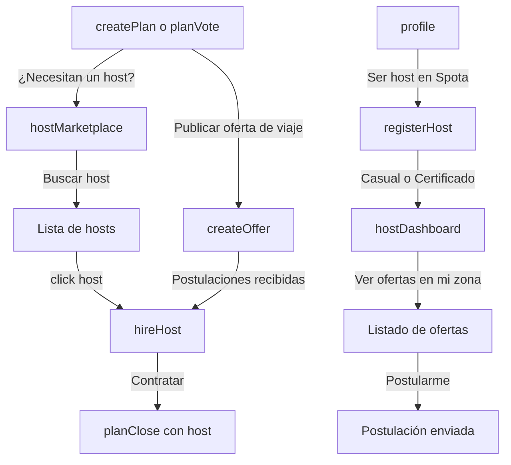

**Notas (D10 + D3)**

- **Entry al Marketplace**: solo contextual desde un plan grupal. Sin plan que lo ancle, contratar un host es una decisión sin contexto. Se eliminó el teaser del Marketplace en Discover.
- **Asimetría Host vs Negocio**: `registerHost` y `hostDashboard` viven dentro del Perfil (un usuario *se vuelve* host como evolución del rol). `bizRegister` no vive en el Perfil (un usuario *es dueño* de un Negocio, identidad separada).

### 3.7 Negocios B2B — CU-19 a CU-23

**Entry points**

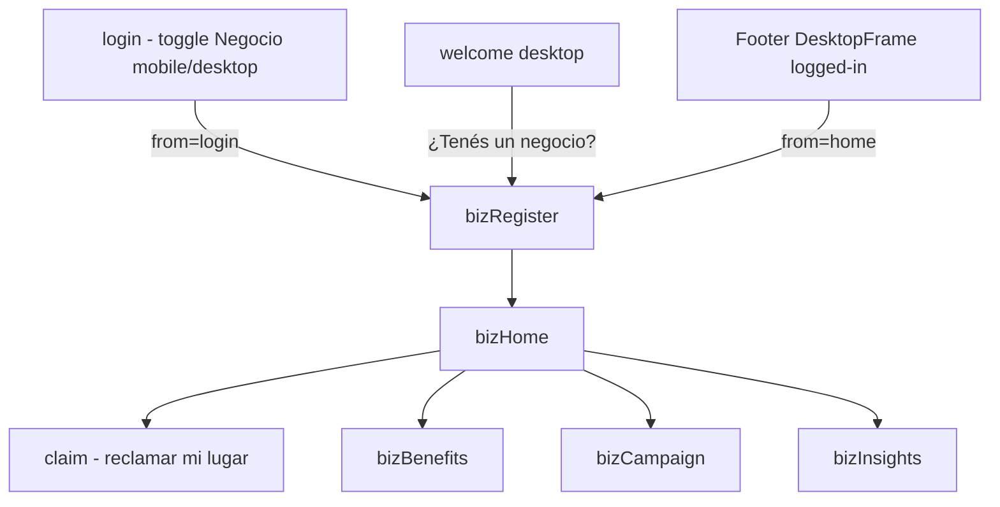

**Notas**

- D17 — el back link de `bizRegister` adapta copy y destino según `params.from`.
- D3 — el panel B2B usa `BizFrame` en desktop (sidebar dedicado) en lugar del `DesktopFrame` general. En mobile, la transición a B2B reemplaza la TabBar por una nav adaptada.
- El logout del panel B2B navega a `login`, no a `home`, para devolver al usuario al estado pre-autenticación correcto.

### 3.8 Perfil — CU-04, CU-05, transversal

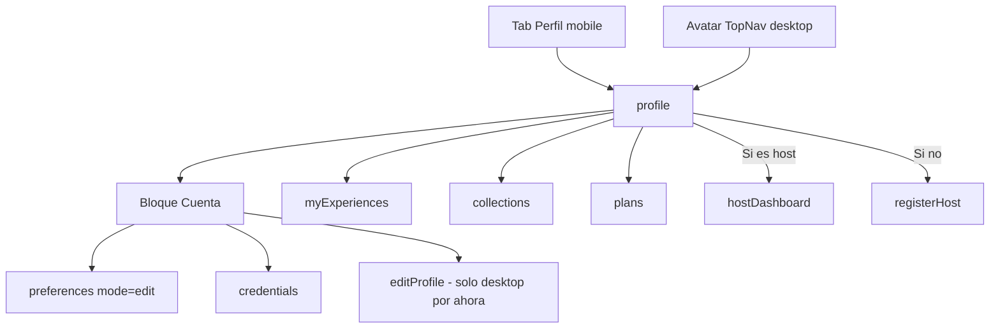

**Notas**

- D13 — en desktop, **el avatar es el único entry al perfil**. El navbar queda enfocado en producto.
- D14 — `preferences` con `mode` flag: `onboarding` desde register, `edit` desde profile. Mismo formulario, dos copys.
- Pendiente — `editProfile` falta en mobile (item activo en `backlog.md` §1).

---

## 4. Tabla CU → pantalla mobile / desktop

Equivalencia 1:1 entre el inventario de pantallas del prototipo mobile y desktop. La columna de notas señala diferencias de composición (no de flujo).

| CU | Pantalla | id mobile | id desktop | Notas |
|---|---|---|---|---|
| CU-01 | Crear cuenta | `register` | `register` | — |
| CU-02 | Iniciar sesión | `login` | `login` | Mobile: foto integrada (D15). Desktop: split layout (D16) |
| CU-03 | Recuperar contraseña | `recover` | `recover` | — |
| CU-04 | Preferencias | `preferences` | `preferences` | `mode` flag onboarding ↔ edit (D14) |
| CU-05 | Credenciales | `credentials` | `credentials` | — |
| CU-06 | Descubrir | `home` | `home` | Concierge-first (D18) |
| CU-06 | Detalle de lugar | `placeDetail` | `placeDetail` | Sub-máquina Proof of Visit (D8) |
| CU-06 | Resultados de búsqueda | `searchResults` | `searchResults` | Mobile: toggle Lista/Mapa. Desktop: 60 % + 40 % sticky (D12) |
| CU-07 | Publicar experiencia | `publish` | `publish` | Wizard 3 pasos (D9) |
| CU-08 | Valorar de la comunidad | `rate` | `rate` | — |
| CU-09 | Mis experiencias | `myExperiences` | `myExperiences` | — |
| CU-10 | Mis colecciones | `collections` | `collections` | — |
| CU-10 | Crear colección | `createCollection` | `createCollection` | Desktop: modal. Mobile: full-screen |
| CU-11 | Detalle de colección | `collectionDetail` | `collectionDetail` | — |
| CU-12 | Mis planes | `plans` | `plans` | — |
| CU-13 | Crear plan grupal | `createPlan` | `createPlan` | HostBlock como slot (D10) |
| CU-13 | Votar plan | `planVote` | `planVote` | HostBlock como slot (D10) |
| CU-14 | Cerrar plan | `planClose` | `planClose` | HostBlock con card de host contratado (D10) |
| CU-15 | Marketplace de hosts | `hostMarketplace` | `hostMarketplace` | Entry contextual (D10) |
| CU-15 | Publicar oferta de viaje | `createOffer` | `createOffer` | — |
| CU-16 | Contratar host | `hireHost` | `hireHost` | — |
| CU-17 | Registrarse como host | `registerHost` | `registerHost` | Entry desde profile (D3) |
| CU-18 | Dashboard de host | `hostDashboard` | `hostDashboard` | — |
| CU-19 | Reclamar lugar | `claim` | `claimPlace` | id distinto entre prototipos por nombrado histórico, mismo CU |
| CU-20 | Registrar negocio | `registerBiz` | `bizRegister` | id distinto, mismo CU. Back contextual (D17) |
| CU-20 | Panel del negocio | `bizHome` | `bizHome` | BizFrame en desktop (D3) |
| CU-21 | Beneficios | `bizBenefits` | `bizBenefits` | — |
| CU-22 | Campaña | `bizCampaign` | `bizCampaign` | — |
| CU-23 | Insights | `bizInsights` | `bizInsights` | — |
| auxiliar | Perfil | `profile` | `profile` | Tab en mobile, avatar en desktop (D13) |
| auxiliar | Editar perfil | — | `editProfile` | Pendiente en mobile (backlog §1) |
| auxiliar | UI Kit / Design System | `uikit` | `uikit` | Mobile: Perfil → Cuenta. Desktop: ✦ del TopNav |
| auxiliar | Welcome (landing pública) | — | `welcome` | Solo desktop. Mobile lo unificó en `login` (D15) |

---

## 5. Diferencias estructurales — resumen

Las diferencias entre mobile y desktop no son arbitrarias: cada una está justificada por una decisión consolidada. Esta tabla las consolida para que un nuevo lector pueda revisar coherencia sin recorrer todo el `Claude.md`.

| Diferencia | Razón |
|---|---|
| TabBar inferior con FAB (mobile) vs TopNav superior + footer (desktop) | Adaptación de plataforma estándar. Mobile prioriza pulgar; desktop prioriza cursor y aprovecha aire horizontal |
| Perfil en tab dedicado (mobile) vs avatar único (desktop) | D13 — el avatar es affordance universal en consumer apps; el navbar desktop queda enfocado en producto |
| `login` con foto integrada (mobile) vs `welcome` + `login` split (desktop) | D15 + D16 — en mobile reduce el tap-count; en desktop el split aprovecha aire para distinguir marketing y transacción |
| `searchResults` con toggle Lista/Mapa (mobile) vs lista + mapa simultáneos (desktop) | D12 — desktop tiene espacio para ambos sin penalizar lectura |
| Buscador permanente en navbar | Solo en mobile (cuando lo había). En desktop se eliminó (D18) — competía contra el input hero del home |
| `createCollection` y `createPlan` como modales (desktop) vs full-screen (mobile) | Patrón canónico — el desktop puede contener acciones cortas en modal sin ocultar el contexto; el mobile no |
| Entry a `bizRegister` | Mobile: solo desde toggle del login. Desktop: tres entry points (welcome, footer DesktopFrame, footer login) con `params.from` (D17) |
| `registerHost` adentro del Perfil; `bizRegister` afuera | D3 — host es evolución del rol del usuario; negocio es identidad separada |
| Marketplace de Hosts entry contextual desde plan | D10 — coherente en ambas plataformas. No hay entry directo desde Discover ni desde Perfil del usuario |

---

## 6. Apéndice — inventario plano de pantallas

Todas las pantallas registradas en runtime, agrupadas por bloque. Sirve como fuente de verdad para el ABM de futuras navegaciones.

**Onboarding & Auth**
`welcome` (solo desktop) · `login` · `register` · `recover` · `preferences` · `credentials` · `editProfile` (solo desktop)

**Descubrir**
`home` · `searchResults` · `placeDetail`

**Experiencias y reputación**
`publish` · `rate` · `myExperiences`

**Colecciones**
`collections` · `collectionDetail` · `createCollection`

**Planificación grupal**
`plans` · `createPlan` · `planVote` · `planClose`

**Marketplace de Hosts**
`hostMarketplace` · `createOffer` · `hireHost` · `registerHost` · `hostDashboard`

**Negocios B2B**
`bizRegister` (mobile: `registerBiz`) · `bizHome` · `claim` (desktop: `claimPlace`) · `bizBenefits` · `bizCampaign` · `bizInsights`

**Otras**
`profile` · `uikit`
