# Mapa de navegación — Spota

Este documento describe los flujos del usuario en el prototipo de Spota, comparando mobile y desktop. La regla es **mismos casos de uso, distinto shell**: los 23 CUs y todos los flujos del usuario son idénticos en ambas plataformas; lo que cambia es la composición de la navegación principal y la composición visual de algunas pantallas pivote, todas justificadas por decisiones consolidadas en `CLAUDE.md` (D1-D18).

> **Versión.** Última pasada de sincronización: cierre de Sesión B+ (audit `entrega/prototipo_vs_cu.md`, 42 items resueltos / diferidos). Cambios principales reflejados acá: CU-08 ⚪ Absorbido en CU-07 (`rate` eliminado del mobile); pantalla `resetPassword` sumada (CU-001-003 pasos 12-21); `welcome` desktop oculto (no es CU); entry directo a `bizSubscribe` desde `bizHome`; mismatch de CUs en planificación y marketplace corregidos.

Los diagramas usan sintaxis Mermaid, que renderiza nativo en GitHub y en VS Code preview. Los identificadores entre paréntesis son los `id` reales de las pantallas registradas en `SCREENS` dentro de cada prototipo.

---

## 1. Árbol de navegación — vista vertical

Vista jerárquica completa partiendo del usuario logueado en `Descubrir` (Home). Cada flecha equivale a un click. Los nombres son los títulos humanos en español; las pantallas que dependen de la plataforma se marcan con línea punteada y nota.

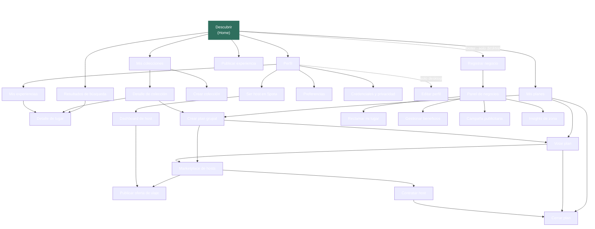

**Lectura del árbol**

- La profundidad máxima del prototipo es **4 clicks** (Home → Mis planes → Crear plan grupal → Marketplace de hosts → Contratar host). Coherente con la regla 5±2 a nivel macro.
- Las acciones core del usuario (buscar, publicar, ver mis cosas) están a **1 o 2 clicks** del Home.
- El Marketplace de Hosts es deliberadamente la rama más profunda (D10): se accede solo desde un plan, sin entry directo.
- El Panel de Negocios es accesible para un usuario logueado solo en desktop (footer del DesktopFrame con `params.from = 'home'`, D17). En mobile la transición a B2B requiere desloguearse y entrar como Negocio desde el toggle del login.
- Las flechas dotted marcan ramas dependientes de plataforma; las sólidas son comunes a mobile y desktop.

---

## 2. Shell de navegación

El shell es la única capa donde mobile y desktop divergen estructuralmente. Las pantallas internas se acceden a través de él.

### 2.1 Mobile — TabBar inferior con FAB central

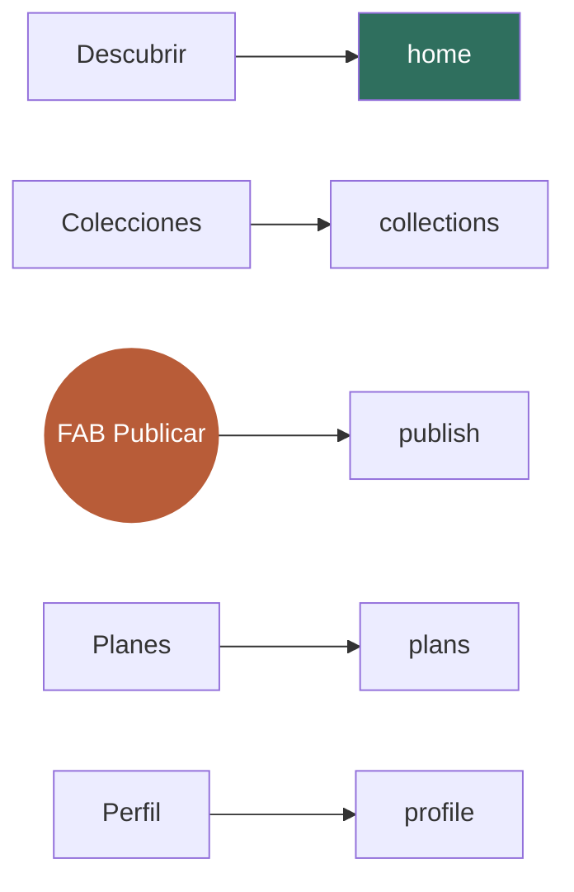

Cinco ítems en la barra inferior. El FAB central en terracota es el atajo a `publish` (CU-07). Las cuatro pestañas convencionales priorizan el alcance del pulgar (los ítems extremos quedan en zona accesible para diestros y zurdos).

### 2.2 Desktop — TopNav superior + footer

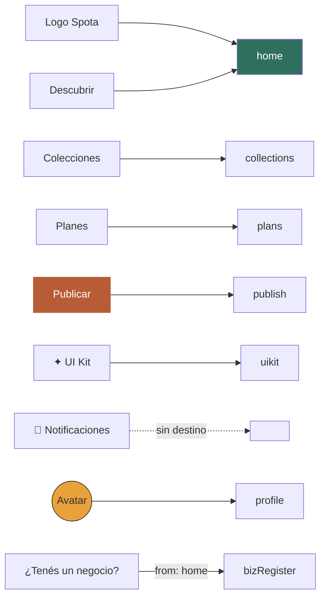

Tres ítems centrales (sin Perfil — D13) y un grupo de acciones a la derecha. **No hay buscador permanente en el TopNav** (D18): la búsqueda es una acción explícita que vive en el home como input hero. El acceso al panel de Negocios se realiza desde el footer del frame con `params.from = 'home'` (D17).

---

## 3. Mapas por bloque funcional

Cada bloque representa un ciclo del usuario. Los flujos son idénticos en mobile y desktop salvo cuando se indica.

### 3.1 Onboarding y Auth — CU-01 a CU-05

El flujo de auth es **simétrico entre mobile y desktop**: ambos arrancan en `login` (no hay landing pública intermedia — ver nota al pie del bloque sobre `welcome`). El recover incluye la pantalla `resetPassword` (CU-001-003 §3.12 pasos 12-21) que se alcanza vía el link del mail (en el prototipo, mediante un "Tip prototipo" en el success de `recover`).

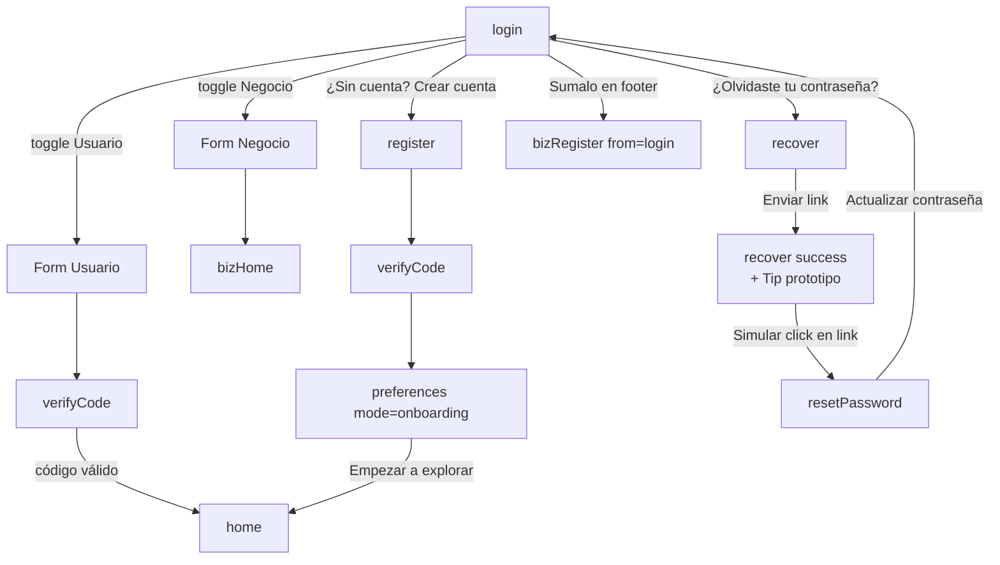

**Diferencias estructurales del bloque**

| Aspecto | Mobile | Desktop | Decisión |
|---|---|---|---|
| Entry inicial al cargar | `login` | `login` (idéntico) | D15 — `welcome` desktop quedó preservado en código pero sin entries (ver nota) |
| Layout del login | Foto fullscreen integrada | Split (foto+hero a la izquierda 55 %, form a la derecha 45 %) | D15, D16 |
| Toggle Usuario/Negocio | Adentro del form de login | Adentro del form (igual) | D3 |
| Entry a `bizRegister` | Toggle del login (`from: login`) | Toggle del login (`from: login`) + footer del DesktopFrame logueado (`from: home`), con D17 | D3, D17 |
| `resetPassword` (pasos 12-21 del CU-001-003) | Pantalla full-screen con form pwd + confirm | `AuthCard` con mismo form | — |

> **Nota — `welcome` desktop.** Quedó preservado en el código por D16 / compatibilidad con el handler `from: 'welcome'` de `bizRegister`, pero no es un CU canónico ni tiene entry points activos en runtime (`nav('welcome')` count = 0). Para fines de arquitectura de información, **tratamos `welcome` como inexistente**.

### 3.2 Descubrir — CU-06

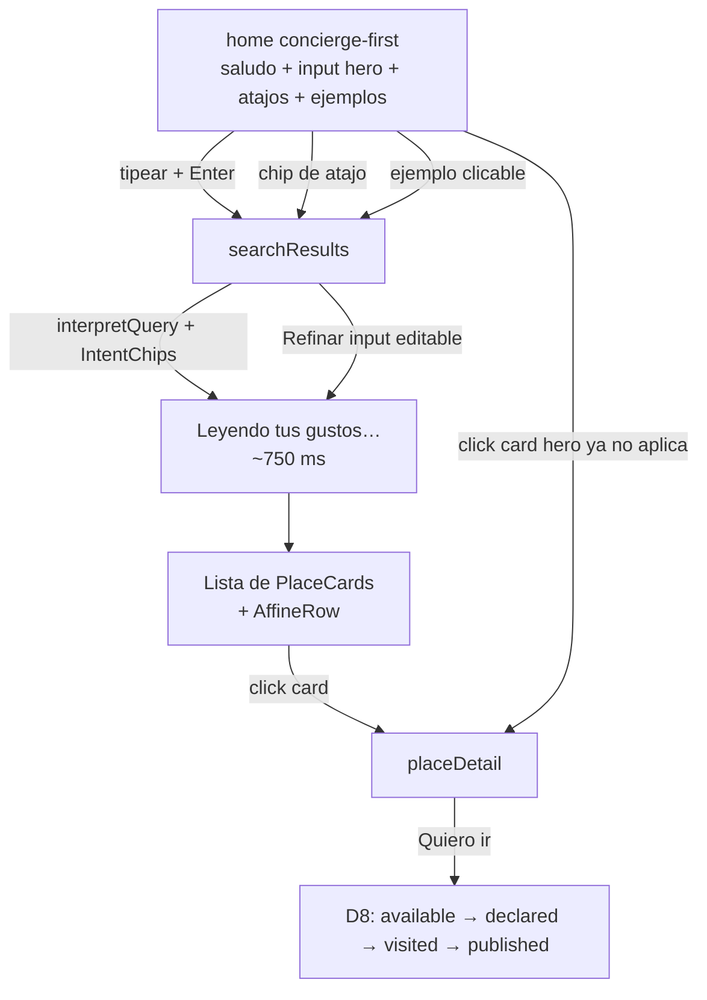

**Diferencias estructurales del bloque**

| Aspecto | Mobile | Desktop |
|---|---|---|
| Vista de resultados | Toggle Lista / Mapa en `searchResults` | Lista 60 % + Mapa 40 % sticky simultáneos (D12) |
| Composición del home | Atajos en flexbox wrap, ejemplos en columna | Atajos en flexbox wrap, ejemplos en grid de 3 columnas, max-width 760 px centrado |
| Input hero | Alto 64 px | Alto 72 px |
| Buscador secundario persistente | n/a | Eliminado (D18) |

### 3.3 Experiencias y reputación — CU-07 a CU-09

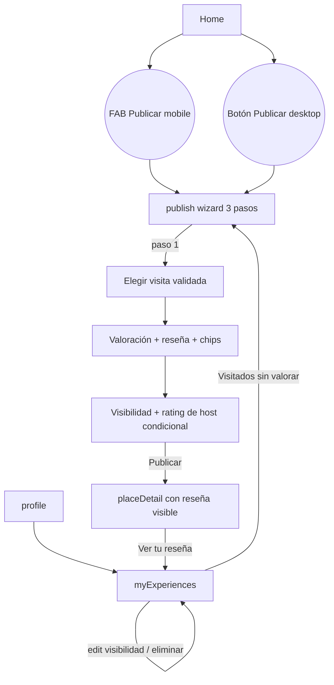

**Notas**

- D9 — wizard de 3 pasos (no 4): la validación GPS ocurre en background y no aparece en el wizard.
- Entry a `publish`: mobile = FAB central (D2); desktop = botón "Publicar" en TopNav (terracota). En ambos es prominente.
- **CU-08 ⚪ Absorbido en CU-07.** La valoración de reseñas de la comunidad pasó a ser **implícita silenciosa** (`propuestas_mejora_cu.md` §3.17 — CU-003-002 absorbido): el sistema infiere "me sirvió" según las reseñas que el usuario navegó durante discovery. No hay pantalla `rate` ni botón "Valorar reseña" — se eliminaron del prototipo mobile en Sesión B para alinear con la decisión canónica.
- Bloque "Calificá al host" en `publish` paso 3 es condicional: aparece solo si la visita seleccionada tiene `host` contratado.
- Redirect post-publish: `placeDetail` (no Profile) para mostrar la reseña en contexto.

### 3.4 Colecciones — CU-10 a CU-11

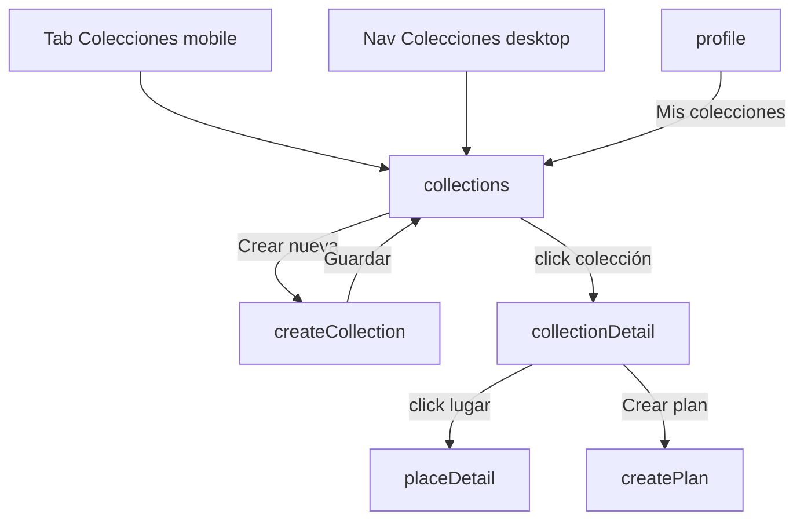

**Notas**

- `createCollection` es modal en desktop (sobre overlay), pantalla full-screen en mobile.
- `collectionDetail` ofrece dos exits funcionales: ir al lugar (`placeDetail`) o convertir la colección en plan grupal (`createPlan`).

### 3.5 Planificación grupal — CU-12 a CU-14

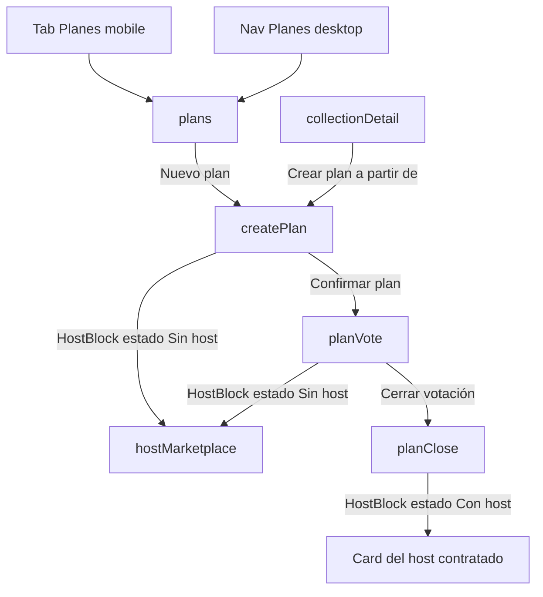

**Notas**

- D10 define la sub-máquina del host como slot persistente en `createPlan`, `planVote` y `planClose`. Solo el creador del plan opera la sub-máquina; los participantes ven el bloque pero no actúan.
- Transición irreversible: una vez contratado un host, no se cancela desde el flujo (sería decisión sin contexto).

### 3.6 Marketplace de Hosts — CU-15 a CU-18

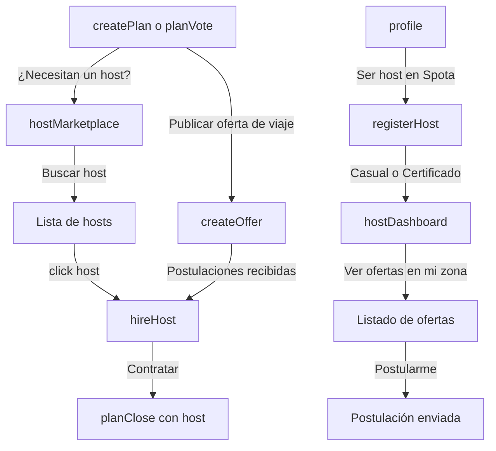

**Notas (D10 + D3)**

- **Entry al Marketplace**: solo contextual desde un plan grupal. Sin plan que lo ancle, contratar un host es una decisión sin contexto. Se eliminó el teaser del Marketplace en Discover.
- **Asimetría Host vs Negocio**: `registerHost` y `hostDashboard` viven dentro del Perfil (un usuario *se vuelve* host como evolución del rol). `bizRegister` no vive en el Perfil (un usuario *es dueño* de un Negocio, identidad separada).

### 3.7 Negocios B2B — CU-19 a CU-23

**Entry points**

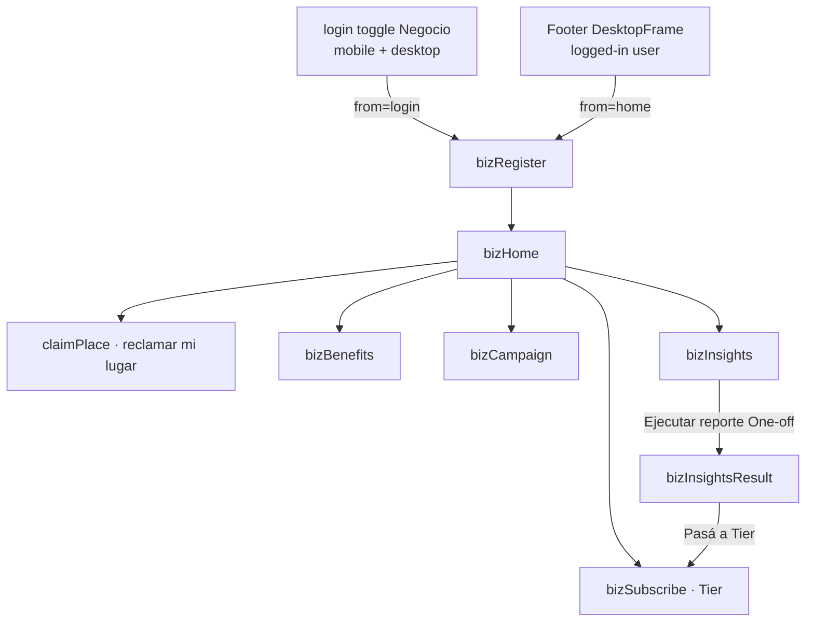

**Notas**

- D17 — el back link de `bizRegister` adapta copy y destino según `params.from` (`login` o `home`).
- D3 — el panel B2B usa `BizFrame` en desktop (sidebar dedicado, con ítems: Dashboard · Beneficios · Campañas · Insights · **Suscripción Tier** · Reclamar otro lugar). En mobile, la transición a B2B reemplaza la TabBar y se navega vía tiles de "Herramientas" en `bizHome`.
- `bizSubscribe` tiene **dos entries**: directo desde `bizHome` (tile mobile / ítem sidebar desktop) y contextual desde `bizInsightsResult` cuando el usuario está en modalidad One-off.
- `bizInsightsResult` es sub-pantalla de CU-23 (resultados del reporte) — no se accede sin ejecutar antes el filtro en `bizInsights`.
- El logout del panel B2B navega a `login` (estado pre-auth correcto).

### 3.8 Perfil — CU-04, CU-05, transversal

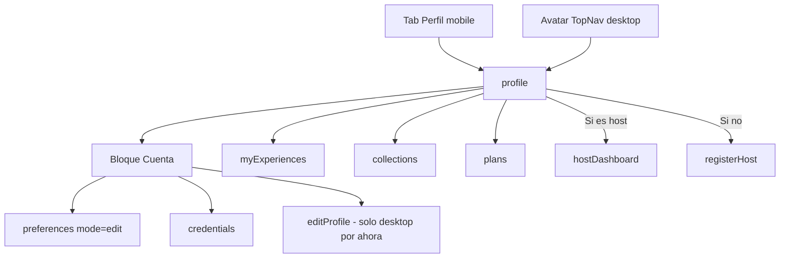

**Notas**

- D13 — en desktop, **el avatar es el único entry al perfil**. El navbar queda enfocado en producto.
- D14 — `preferences` con `mode` flag: `onboarding` desde register, `edit` desde profile. Mismo formulario, dos copys.
- Pendiente — `editProfile` falta en mobile (item activo en `backlog.md` §1).

---

## 4. Tabla CU → pantalla mobile / desktop

Equivalencia 1:1 entre el inventario de pantallas del prototipo mobile y desktop. La columna de notas señala diferencias de composición (no de flujo).

| CU | Pantalla | id mobile | id desktop | Notas |
|---|---|---|---|---|
| CU-01 | Crear cuenta | `register` | `register` | — |
| CU-02 | Iniciar sesión | `login` | `login` | Mobile: foto integrada (D15). Desktop: split layout (D16) |
| CU-02 | Verificación por código | `verifyCode` | `verifyCode` | Auxiliar de CU-02 (6 dígitos, tip prototipo `123456`) |
| CU-03 | Recuperar contraseña (pedir link) | `recover` | `recover` | Pasos 1-9 del CU-001-003 |
| CU-03 | Nueva contraseña | `resetPassword` | `resetPassword` | Pasos 12-21 del CU-001-003. Entry via tip prototipo en el success de `recover` |
| CU-04 | Preferencias | `preferences` | `preferences` | `mode` flag onboarding ↔ edit (D14) |
| CU-05 | Credenciales | `credentials` | `credentials` | — |
| CU-06 | Descubrir | `home` | `home` | Concierge-first (D18) |
| CU-06 | Detalle de lugar | `placeDetail` | `placeDetail` | Sub-máquina Proof of Visit (D8) |
| CU-06 | Resultados de búsqueda | `searchResults` | `searchResults` | Mobile: toggle Lista/Mapa. Desktop: 60 % + 40 % sticky (D12) |
| CU-07 | Publicar experiencia | `publish` | `publish` | Wizard 3 pasos (D9). Absorbe CU-08 como valoración implícita |
| ⚪ CU-08 | Valorar reseña de la comunidad | — | — | **Absorbido en CU-07** (`propuestas_mejora_cu.md` §3.17). Sin pantalla. La valoración es implícita silenciosa |
| CU-09 | Mis experiencias | `myExperiences` | `myExperiences` | — |
| CU-10 | Crear colección | `createCollection` | `createCollection` | Desktop: modal. Mobile: full-screen. Entry alt: `placeDetail` botón "Guardar" |
| CU-11 | Mis colecciones | `collections` | `collections` | — |
| CU-11 | Detalle de colección | `collectionDetail` | `collectionDetail` | — |
| CU-11 | Filtros de colecciones | `collectionsFilter` | `collectionsFilter` | — |
| CU-12 | Crear plan grupal | `createPlan` | `createPlan` | HostBlock como slot (D10) |
| CU-13 | Votar plan | `planVote` | `planVote` | HostBlock como slot (D10) |
| CU-14 | Cerrar plan | `planClose` | `planClose` | HostBlock con card de host contratado (D10). Desktop: Fecha/Hora editables + lista nominal |
| CU-15 | Publicar oferta de viaje | `createOffer` | `createOffer` | — |
| CU-16 | Marketplace de hosts | `hostMarketplace` | `hostMarketplace` | Entry contextual desde plan (D10) |
| CU-16 | Contratar host | `hireHost` | `hireHost` | — |
| CU-17 | Registrarse como host | `registerHost` | `registerHost` | Entry desde profile (D3). Pasa `params.modalidad` a hostDashboard |
| CU-18 | Dashboard de host | `hostDashboard` | `hostDashboard` | Refleja `modalidad` (Casual/Certificado) |
| CU-19 | Reclamar lugar | `claimPlace` | `claimPlace` | id unificado en ambos prototipos |
| CU-20 | Registrar negocio | `bizRegister` | `bizRegister` | id unificado. Back contextual (D17) |
| CU-20 | Panel del negocio | `bizHome` | `bizHome` | BizFrame en desktop (D3) |
| CU-21 | Beneficios | `bizBenefits` | `bizBenefits` | Edit/trash funcionales con confirm |
| CU-22 | Campaña | `bizCampaign` | `bizCampaign` | — |
| CU-23 | Insights · filtros | `bizInsights` | `bizInsights` | — |
| CU-23 | Insights · resultado | `bizInsightsResult` | `bizInsightsResult` | Sub-pantalla del reporte ejecutado |
| CU-23 | Suscripción Tier | `bizSubscribe` | `bizSubscribe` | Auxiliar de CU-23 (sub-flujo de monetización). Entry desde `bizHome` + contextual desde `bizInsightsResult` |
| auxiliar | Perfil | `profile` | `profile` | Tab en mobile, avatar en desktop (D13) |
| auxiliar | Editar perfil | — | `editProfile` | Pendiente en mobile (backlog §1) |
| auxiliar | UI Kit / Design System | `uikit` | `uikit` | Mobile: Perfil → Cuenta. Desktop: ✦ del TopNav. Sincronizado con D1-D18 |

---

## 5. Diferencias estructurales — resumen

Las diferencias entre mobile y desktop no son arbitrarias: cada una está justificada por una decisión consolidada. Esta tabla las consolida para que un nuevo lector pueda revisar coherencia sin recorrer todo el `Claude.md`.

| Diferencia | Razón |
|---|---|
| TabBar inferior con FAB (mobile) vs TopNav superior + footer (desktop) | Adaptación de plataforma estándar. Mobile prioriza pulgar; desktop prioriza cursor y aprovecha aire horizontal |
| Perfil en tab dedicado (mobile) vs avatar único (desktop) | D13 — el avatar es affordance universal en consumer apps; el navbar desktop queda enfocado en producto |
| Layout del `login` | Mobile: foto integrada al fullscreen (D15). Desktop: split (foto+hero a la izquierda 55 %, form a la derecha 45 %) (D16). Ambos arrancan en `login` como pantalla inicial |
| `searchResults` con toggle Lista/Mapa (mobile) vs lista + mapa simultáneos (desktop) | D12 — desktop tiene espacio para ambos sin penalizar lectura |
| Buscador permanente en navbar | Solo en mobile (cuando lo había). En desktop se eliminó (D18) — competía contra el input hero del home |
| `createCollection` y `createPlan` como modales (desktop) vs full-screen (mobile) | Patrón canónico — el desktop puede contener acciones cortas en modal sin ocultar el contexto; el mobile no |
| Entry a `bizRegister` | Mobile: toggle del login (`from: login`). Desktop: toggle del login (`from: login`) + footer del DesktopFrame logueado (`from: home`). En ambos casos D17 |
| `registerHost` adentro del Perfil; `bizRegister` afuera | D3 — host es evolución del rol del usuario; negocio es identidad separada |
| Marketplace de Hosts entry contextual desde plan | D10 — coherente en ambas plataformas. No hay entry directo desde Discover ni desde Perfil del usuario |

---

## 6. Apéndice — inventario plano de pantallas

Todas las pantallas con entry activo en runtime, agrupadas por bloque. Sirve como fuente de verdad para el ABM de futuras navegaciones.

**Onboarding & Auth**
`login` · `verifyCode` · `register` · `recover` · `resetPassword` · `preferences` · `credentials` · `editProfile` (solo desktop)

**Descubrir**
`home` · `searchResults` · `placeDetail`

**Experiencias y reputación**
`publish` · `myExperiences`

**Colecciones**
`collections` · `collectionsFilter` · `collectionDetail` · `createCollection`

**Planificación grupal**
`plans` · `createPlan` · `planVote` · `planClose`

**Marketplace de Hosts**
`hostMarketplace` · `createOffer` · `hireHost` · `registerHost` · `hostDashboard`

**Negocios B2B**
`bizRegister` · `bizHome` · `claimPlace` · `bizBenefits` · `bizCampaign` · `bizInsights` · `bizInsightsResult` · `bizSubscribe`

**Otras**
`profile` · `uikit`

**Pantallas preservadas en código sin entry activo (no se navegan)**
- `welcome` (solo desktop) — landing pública. Quedó en el código por D16 / compatibilidad con `from: 'welcome'` de `bizRegister`. **No es CU canónico** y `nav('welcome')` count = 0 en runtime.
- `rate` / `ScreenRateCommunity` (eliminada del mobile en Sesión B) — CU-08 ⚪ Absorbido en CU-07 (`propuestas_mejora_cu.md` §3.17).
